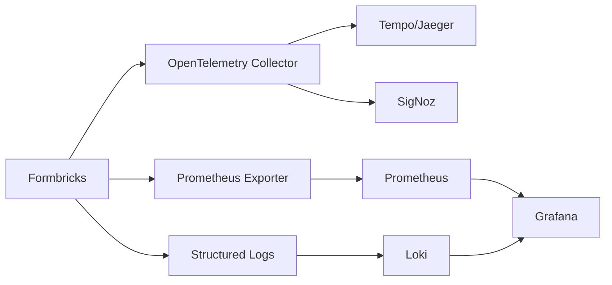

Comprehensive monitoring and observability for self-hosted Formbricks deployments using industry-standard tools.

## Observability Stack Overview

Formbricks supports multiple observability approaches:



**Supported Backends:**

- **Metrics**: Prometheus, OpenTelemetry (OTLP)
- **Traces**: Jaeger, Tempo, SigNoz, Honeycomb
- **Logs**: Pino with optional OpenTelemetry transport

## OpenTelemetry Integration

Formbricks includes comprehensive OpenTelemetry instrumentation for metrics and distributed tracing.

### Configuration

Enable OpenTelemetry by setting environment variables:

```bash .env
# OTLP Endpoint (base URL - exporters append /v1/traces and /v1/metrics)
OTEL_EXPORTER_OTLP_ENDPOINT=http://otel-collector:4318

# Protocol (http/protobuf or http/json)
OTEL_EXPORTER_OTLP_PROTOCOL=http/protobuf

# Service identification
OTEL_SERVICE_NAME=formbricks
OTEL_RESOURCE_ATTRIBUTES=deployment.environment=production

# Trace sampling (reduce overhead by sampling)
OTEL_TRACES_SAMPLER=parentbased_traceidratio
OTEL_TRACES_SAMPLER_ARG=0.1  # Sample 10% of traces
```

### Sampler Types

Control which traces are collected:

| Sampler | Description | Use Case |
|---------|-------------|----------|
| `always_on` | Trace every request | Development, debugging |
| `always_off` | Disable tracing | Production (metrics only) |
| `traceidratio` | Sample by percentage | Production (reduce overhead) |
| `parentbased_traceidratio` | Respect parent span decisions | Distributed systems |
| `parentbased_always_on` | Trace if parent traced | Microservices |

**Recommended Production Config:**

```bash
OTEL_TRACES_SAMPLER=parentbased_traceidratio
OTEL_TRACES_SAMPLER_ARG=0.05  # 5% sampling for high-traffic
```

### Instrumented Components

Formbricks automatically instruments:

<CardGroup cols={2}>
  <Card title="HTTP Requests" icon="globe">
    - Incoming HTTP requests
    - Outgoing HTTP calls
    - Request/response headers
    - Status codes and errors
  </Card>
  
  <Card title="Database Queries" icon="database">
    - Prisma ORM queries
    - Query duration
    - Connection pool metrics
    - Query parameters (sanitized)
  </Card>
  
  <Card title="Node.js Runtime" icon="server">
    - Event loop lag
    - Memory usage (heap)
    - Garbage collection
    - Active handles/requests
  </Card>
  
  <Card title="External Services" icon="plug">
    - SMTP connections
    - S3 storage operations
    - Redis cache operations
    - License API calls
  </Card>
</CardGroup>

**Ignored Endpoints:**

To reduce noise, these endpoints are excluded from tracing:

```typescript
// From instrumentation-node.ts:159
ignoreIncomingRequestHook: (req) => {
  const url = req.url || "";
  return url === "/health" || 
         url.startsWith("/metrics") || 
         url === "/api/v2/health";
}
```

### Implementation Reference

OpenTelemetry configuration: `apps/web/instrumentation-node.ts:1`

Key features:
- Auto-instrumentation for Node.js libraries
- Prisma database tracing
- Configurable sampling strategies
- Support for both OTLP metrics and traces
- Graceful shutdown handling

## Prometheus Metrics

### Enable Prometheus Exporter

Expose metrics on `/metrics` endpoint:

```bash
# Enable Prometheus exporter
PROMETHEUS_ENABLED=1

# Configure exporter port (default: 9464)
PROMETHEUS_EXPORTER_PORT=9464
```

Metrics are exposed at: `http://localhost:9464/metrics`

### Kubernetes ServiceMonitor

For Kubernetes with Prometheus Operator:

```yaml values.yaml
serviceMonitor:
  enabled: true
  additionalLabels:
    release: prometheus  # Match your Prometheus label selector
  endpoints:
    - interval: 15s       # Scrape every 15 seconds
      path: /metrics
      port: metrics
```

Prometheus will automatically discover and scrape Formbricks pods.

### Available Metrics

Formbricks exposes metrics via OpenTelemetry SDK:

**HTTP Metrics:**
```promql
# Request duration histogram
http_server_request_duration_milliseconds_bucket

# Request count by method and status
http_server_requests_total{method="POST", status="200"}

# Active requests
http_server_active_requests
```

**Database Metrics:**
```promql
# Query duration
db_client_operation_duration_milliseconds

# Connection pool usage
db_client_connections_usage

# Query count by operation
db_client_operation_count{operation="findUnique"}
```

**Runtime Metrics:**
```promql
# Heap memory used
process_runtime_nodejs_memory_heap_used_bytes

# Event loop lag
process_runtime_nodejs_event_loop_lag_milliseconds

# Garbage collection duration
process_runtime_nodejs_gc_duration_milliseconds
```

### Grafana Dashboard

Example Prometheus queries for Grafana:

<CodeGroup>
```promql Request Rate
sum(rate(http_server_requests_total[5m])) by (method, status)
```

```promql Error Rate
sum(rate(http_server_requests_total{status=~"5.."}[5m])) 
/ 
sum(rate(http_server_requests_total[5m]))
```

```promql Response Time p95
histogram_quantile(0.95, 
  sum(rate(http_server_request_duration_milliseconds_bucket[5m])) by (le)
)
```

```promql Database Connections
db_client_connections_usage{state="used"}
```
</CodeGroup>

## Structured Logging

### Log Configuration

Formbricks uses Pino for structured JSON logging:

```bash
# Set minimum log level
LOG_LEVEL=info  # Options: debug, info, warn, error, fatal
```

**Log Levels:**

- `debug`: Verbose debugging information (development only)
- `info`: General informational messages
- `warn`: Warning messages, non-critical issues
- `error`: Error events that might still allow continued operation
- `fatal`: Critical errors causing application shutdown

### Log Output Format

Production logs are structured JSON:

```json
{
  "level": 30,
  "time": 1709467234567,
  "pid": 1,
  "hostname": "formbricks-7d8f4c9b-xz2k9",
  "msg": "OpenTelemetry initialized",
  "service": "formbricks",
  "version": "2.0.0",
  "environment": "production"
}
```

### OpenTelemetry Log Correlation

Enable log-trace correlation with SigNoz or similar:

```bash
# Logs automatically include trace context when OpenTelemetry is enabled
OTEL_EXPORTER_OTLP_ENDPOINT=http://signoz:4318
```

Pino logger configuration: `packages/logger/src/logger.ts:45`

Features:
- Automatic trace ID injection
- Span context in logs
- Log shipping to OpenTelemetry collector
- Correlated traces and logs in SigNoz

### Log Aggregation

For centralized logging:

<Tabs>
  <Tab title="Loki (Grafana)">
    **Docker:**
    ```yaml docker-compose.yml
    formbricks:
      logging:
        driver: loki
        options:
          loki-url: "http://loki:3100/loki/api/v1/push"
          labels: "service=formbricks,environment=production"
    ```
    
    **Kubernetes:**
    ```yaml
    # Install Promtail as DaemonSet to scrape pod logs
    helm install promtail grafana/promtail \
      --set config.lokiAddress=http://loki:3100/loki/api/v1/push
    ```
  </Tab>
  
  <Tab title="Elasticsearch">
    **Filebeat Configuration:**
    ```yaml filebeat.yml
    filebeat.inputs:
      - type: container
        paths:
          - '/var/lib/docker/containers/*/*.log'
        processors:
          - add_kubernetes_metadata:
              host: ${NODE_NAME}
    
    output.elasticsearch:
      hosts: ['elasticsearch:9200']
      index: "formbricks-logs-%{+yyyy.MM.dd}"
    ```
  </Tab>
  
  <Tab title="CloudWatch (AWS)">
    **Kubernetes with Fluent Bit:**
    ```yaml
    helm install fluent-bit fluent/fluent-bit \
      --set cloudWatch.enabled=true \
      --set cloudWatch.region=us-east-1 \
      --set cloudWatch.logGroupName=/aws/eks/formbricks
    ```
  </Tab>
</Tabs>

## Distributed Tracing

### Jaeger Setup

Deploy Jaeger for trace visualization:

<Tabs>
  <Tab title="Docker Compose">
    ```yaml docker-compose.yml
    jaeger:
      image: jaegertracing/all-in-one:latest
      ports:
        - "16686:16686"  # UI
        - "4318:4318"    # OTLP HTTP
      environment:
        - COLLECTOR_OTLP_ENABLED=true
    
    formbricks:
      # ... existing config
      environment:
        - OTEL_EXPORTER_OTLP_ENDPOINT=http://jaeger:4318
        - OTEL_TRACES_SAMPLER=always_on
    ```
    
    Access Jaeger UI: `http://localhost:16686`
  </Tab>
  
  <Tab title="Kubernetes">
    ```bash
    # Install Jaeger Operator
    kubectl create namespace observability
    kubectl apply -f https://github.com/jaegertracing/jaeger-operator/releases/latest/download/jaeger-operator.yaml -n observability
    
    # Deploy Jaeger instance
    cat <<EOF | kubectl apply -f -
    apiVersion: jaegertracing.io/v1
    kind: Jaeger
    metadata:
      name: jaeger
      namespace: observability
    spec:
      strategy: allInOne
      ingress:
        enabled: true
    EOF
    ```
    
    Configure Formbricks:
    ```yaml values.yaml
    deployment:
      env:
        OTEL_EXPORTER_OTLP_ENDPOINT: "http://jaeger-collector.observability:4318"
        OTEL_TRACES_SAMPLER: "parentbased_traceidratio"
        OTEL_TRACES_SAMPLER_ARG: "0.1"
    ```
  </Tab>
</Tabs>

### SigNoz (Full Stack Observability)

SigNoz provides metrics, traces, and logs in one platform:

```bash
# Deploy SigNoz with Docker Compose
git clone https://github.com/SigNoz/signoz.git
cd signoz/deploy
./install.sh
```

Configure Formbricks:

```bash
OTEL_EXPORTER_OTLP_ENDPOINT=http://signoz:4318
OTEL_SERVICE_NAME=formbricks
OTEL_TRACES_SAMPLER=parentbased_traceidratio
OTEL_TRACES_SAMPLER_ARG=0.1
```

Access SigNoz UI: `http://localhost:3301`

**Features:**
- Unified metrics, traces, and logs
- Automatic service topology mapping
- Query builder for custom dashboards
- Alerts and notifications

## Application Health Checks

### Health Endpoints

Formbricks exposes health check endpoints:

```bash
# Basic health check (fast)
GET /health
Response: 200 OK

# Detailed health with dependencies
GET /api/v2/health
Response: 200 OK (if all dependencies healthy)
```

### Kubernetes Probes

Configured in Helm values:

```yaml values.yaml
deployment:
  probes:
    # Startup probe - wait for app to be ready initially
    startupProbe:
      failureThreshold: 30      # Allow 5 minutes to start
      periodSeconds: 10
      tcpSocket:
        port: 3000
    
    # Readiness probe - control traffic routing
    readinessProbe:
      failureThreshold: 3
      periodSeconds: 10
      timeoutSeconds: 5
      httpGet:
        path: /health
        port: 3000
    
    # Liveness probe - restart unhealthy containers
    livenessProbe:
      failureThreshold: 3
      periodSeconds: 10
      timeoutSeconds: 5
      httpGet:
        path: /health
        port: 3000
```

**Probe Behavior:**

- **Startup**: Delays other probes until app is initialized
- **Readiness**: Removes pod from service endpoints if failing
- **Liveness**: Restarts container if failing

<Warning>
Set `initialDelaySeconds` appropriately to avoid premature restarts during startup.
</Warning>

## Usage Analytics & Telemetry

### Formbricks Internal Telemetry

Formbricks sends anonymous usage statistics for license validation and product improvement:

**Data Collected:**
- Instance ID (hashed organization ID)
- Usage counts (organizations, users, surveys, responses)
- Feature enablement (SSO, S3, integrations)
- Version information
- Infrastructure details (SMTP configured, S3 configured, etc.)

**Implementation**: `apps/web/app/api/(internal)/pipeline/lib/telemetry.ts:21`

**How It Works:**

1. Runs automatically every 24 hours via pipeline API
2. Uses distributed locking via Redis to prevent duplicate sends
3. Sends to `https://ee.formbricks.com/api/v1/instances/{instanceId}/usage-updates`
4. Non-blocking, non-essential operation

**Privacy:**
- No personally identifiable information (PII) is sent
- No survey content or responses
- Instance ID is a one-way hash
- Respects enterprise license terms

<Note>
Telemetry cannot be disabled as it's required for enterprise license validation.
</Note>

## Alerting

### Prometheus Alertmanager

Example alert rules:

```yaml prometheus-rules.yml
groups:
  - name: formbricks
    interval: 30s
    rules:
      # High error rate
      - alert: HighErrorRate
        expr: |
          sum(rate(http_server_requests_total{status=~"5.."}[5m])) 
          / 
          sum(rate(http_server_requests_total[5m])) > 0.05
        for: 5m
        labels:
          severity: warning
        annotations:
          summary: "High error rate detected"
          description: "Error rate is {{ $value | humanizePercentage }}"
      
      # Slow response times
      - alert: SlowResponseTime
        expr: |
          histogram_quantile(0.95, 
            sum(rate(http_server_request_duration_milliseconds_bucket[5m])) by (le)
          ) > 1000
        for: 10m
        labels:
          severity: warning
        annotations:
          summary: "Slow API response times"
          description: "P95 latency is {{ $value }}ms"
      
      # Database connection pool exhaustion
      - alert: DatabaseConnectionPoolHigh
        expr: db_client_connections_usage{state="used"} / db_client_connections_limit > 0.8
        for: 5m
        labels:
          severity: critical
        annotations:
          summary: "Database connection pool nearly exhausted"
          description: "Using {{ $value | humanizePercentage }} of connections"
      
      # Pod not ready
      - alert: FormbricksPodNotReady
        expr: kube_pod_status_ready{pod=~"formbricks-.*"} == 0
        for: 5m
        labels:
          severity: critical
        annotations:
          summary: "Formbricks pod not ready"
          description: "Pod {{ $labels.pod }} has been not ready for 5 minutes"
```

### Notification Channels

Configure Alertmanager receivers:

<Tabs>
  <Tab title="Slack">
    ```yaml alertmanager.yml
    receivers:
      - name: 'slack'
        slack_configs:
          - api_url: 'https://hooks.slack.com/services/YOUR/WEBHOOK/URL'
            channel: '#alerts'
            title: 'Formbricks Alert'
            text: '{{ range .Alerts }}{{ .Annotations.description }}{{ end }}'
    ```
  </Tab>
  
  <Tab title="PagerDuty">
    ```yaml alertmanager.yml
    receivers:
      - name: 'pagerduty'
        pagerduty_configs:
          - service_key: 'YOUR_PAGERDUTY_SERVICE_KEY'
            description: '{{ .CommonAnnotations.summary }}'
    ```
  </Tab>
  
  <Tab title="Email">
    ```yaml alertmanager.yml
    receivers:
      - name: 'email'
        email_configs:
          - to: 'ops-team@example.com'
            from: 'alertmanager@example.com'
            smarthost: 'smtp.example.com:587'
            auth_username: 'alerts'
            auth_password: 'password'
    ```
  </Tab>
</Tabs>

## Error Tracking with Sentry

Formbricks supports Sentry for error tracking:

```bash
# Sentry DSN for error reporting
SENTRY_DSN=https://xxxx@yyyy.ingest.sentry.io/zzzz

# Environment tag
SENTRY_ENVIRONMENT=production

# For source map uploads during build
SENTRY_AUTH_TOKEN=your_auth_token
```

**What Gets Tracked:**
- Unhandled exceptions
- Promise rejections
- React error boundaries
- API errors
- Database errors

**Sentry Configuration**: `apps/web/sentry.server.config.ts:1`

<Note>
Sentry telemetry is disabled by default in Formbricks configuration to reduce noise.
</Note>

## Monitoring Dashboard Examples

### Grafana Dashboard JSON

Key panels to include:

1. **Request Rate**:
   ```promql
   sum(rate(http_server_requests_total[5m])) by (method)
   ```

2. **Error Rate**:
   ```promql
   sum(rate(http_server_requests_total{status=~"5.."}[5m]))
   ```

3. **Response Time Percentiles**:
   ```promql
   histogram_quantile(0.50, sum(rate(http_server_request_duration_milliseconds_bucket[5m])) by (le))
   histogram_quantile(0.95, sum(rate(http_server_request_duration_milliseconds_bucket[5m])) by (le))
   histogram_quantile(0.99, sum(rate(http_server_request_duration_milliseconds_bucket[5m])) by (le))
   ```

4. **Database Query Duration**:
   ```promql
   rate(db_client_operation_duration_milliseconds_sum[5m]) 
   / 
   rate(db_client_operation_duration_milliseconds_count[5m])
   ```

5. **Pod Resource Usage**:
   ```promql
   container_memory_working_set_bytes{pod=~"formbricks-.*"}
   rate(container_cpu_usage_seconds_total{pod=~"formbricks-.*"}[5m])
   ```

## Best Practices

<Check>
**Metrics Collection**
- Start with Prometheus for simplicity
- Use OpenTelemetry for advanced tracing needs
- Sample traces in production (5-10%) to reduce overhead
- Retain metrics for at least 30 days
- Monitor both application and infrastructure metrics
</Check>

<Check>
**Log Management**
- Use structured JSON logging in production
- Set appropriate log levels (info or warn in production)
- Centralize logs for multi-instance deployments
- Implement log rotation and retention policies
- Correlate logs with traces via trace IDs
</Check>

<Check>
**Alerting Strategy**
- Alert on symptoms, not causes (e.g., "high latency" not "high CPU")
- Set appropriate thresholds to avoid alert fatigue
- Include runbook links in alert annotations
- Test alerts in staging before production
- Review and tune alerts regularly
</Check>

<Check>
**Performance Monitoring**
- Track key metrics: request rate, error rate, latency (RED method)
- Monitor database query performance
- Set up synthetic monitoring for critical user flows
- Establish SLIs/SLOs for important services
- Perform regular load testing
</Check>

## Troubleshooting

<AccordionGroup>
  <Accordion title="Metrics Not Appearing in Prometheus">
    **Checklist:**
    
    1. Verify `PROMETHEUS_ENABLED=1` is set
    2. Check `/metrics` endpoint is accessible:
       ```bash
       curl http://formbricks:9464/metrics
       ```
    3. Verify ServiceMonitor labels match Prometheus selector
    4. Check Prometheus scrape targets:
       ```promql
       up{job="formbricks"}
       ```
    5. Review Prometheus logs for scrape errors
  </Accordion>

  <Accordion title="Traces Not Visible in Jaeger">
    **Solutions:**
    
    1. Verify OTLP endpoint is correct and reachable
    2. Check sampling configuration (ensure not `always_off`)
    3. Verify Jaeger collector is running and accepting OTLP
    4. Review Formbricks logs for OTLP export errors
    5. Test with `OTEL_TRACES_SAMPLER=always_on` temporarily
  </Accordion>

  <Accordion title="High Cardinality Metrics">
    **Issue**: Too many unique label combinations causing performance issues
    
    **Solutions**:
    1. Avoid labels with unbounded values (user IDs, timestamps)
    2. Use trace sampling instead of labeling every request
    3. Aggregate before exporting if possible
    4. Review Prometheus queries for high cardinality
  </Accordion>
</AccordionGroup>

## Further Resources

- [OpenTelemetry Documentation](https://opentelemetry.io/docs/)
- [Prometheus Best Practices](https://prometheus.io/docs/practices/naming/)
- [Grafana Dashboards](https://grafana.com/grafana/dashboards/)
- [SigNoz Documentation](https://signoz.io/docs/)
- [Jaeger Documentation](https://www.jaegertracing.io/docs/)

<Info>
For help configuring monitoring for large-scale deployments, [contact Formbricks support](https://formbricks.com/contact).
</Info>